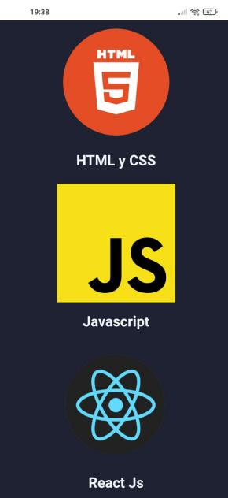

# Tarea

Para esta tarea tenemos como objetivo construir los siguientes ejemplos:

# Ejercicio 1

En base a lo visto en clase arme una barra de navegación como la siguiente:


Deberá generar el HTML y css para este ejercicio.

Dentro de la carpeta images cuenta con los recursos para armarla.

# Ejercicio 2
Deberá construir una landing page, una página con tres secciones como se ven la siguiente imagen:

\
\


Estas tres secciones pertenece a una misma página, lo que tienen de particular es que cada sección ocupa el alto entero (height) de la pantalla, esto da la ilusión de secciones dentro de una landing page.

Deberá armar un HTML que tenga dentro del body 3 secciones (use la etiqueta ```<section>```), cada una de esas secciones tendrá su propio estilo "flex" y organizará los elementos internos en fila o en columna según corresponda.

No es necesario que su landing page se vea exactamente con esta, lo importate que cada cada sección tome todo el alto de la pantalla. Para eso utilice la propiedad:
```
height: 100vh;
```

En la carpeta images cuenta con recursos para armar la landing de las imagenes.

# Ejercicio 3
Integre el ejercicio 1 y ejercicio 2 en un único HTML y único archivo CSS. La pagina deberá verse responsiva.