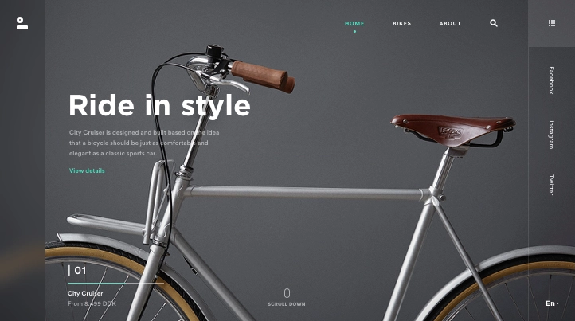

# Actividad

Para esta tarea buscaremos aplicar lo aprendido con el responsive design y el "Minimalismo Moderno".

Observando los siguientes ejemplos, utilicelos para crear un diseño basado en ellos, deberá traducir uno estos ejemplos de interfaces de escritorio a diseños móviles. No es necesario que se vea exactamente como en la imagen, adaptele a un diseño más minimalista y apto móvil según lo visto en clase.

## Pagina de noticias

## Pagina de bicicletas

