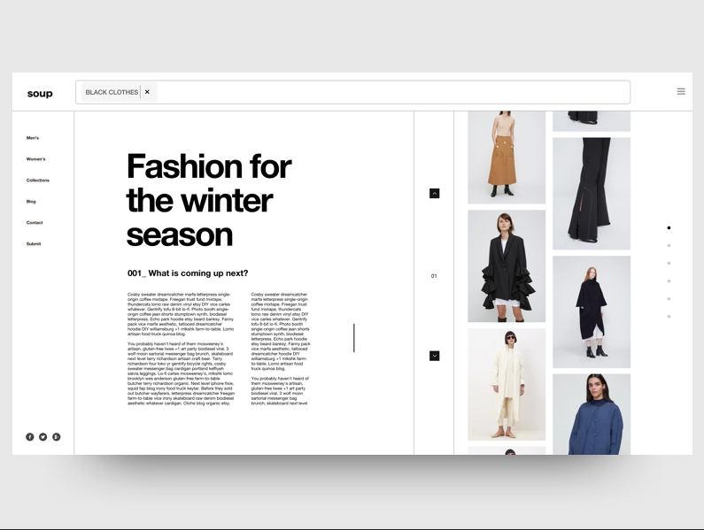

# Ejercicio de profundización

__IMPORTANTE__: Tenga en cuenta que este ejercicio puede demorar un montón de tiempo, realice hasta donde usted se sienta satisfecho y no pierda el foco en el resto de la cursada o el proyecto.

Para esta desafio deberá aplicar lo aprendido con el responsive design y el "Minimalismo Moderno".

Dentro de esta carpeta encontrará los siguientes ejemplos:

## Pagina de noticias

## Pagina de bicicletas

Su misión, si decida aceptarla, es observar los ejemplos y utilizarlos para crear un diseño basado en ellos. Deberá traducir uno de estos ejemplos de interfaces de escritorio a diseños móviles. No es necesario que se vea exactamente como en la imagen o que utilice sus recursos, adaptele a un diseño más minimalista y apto móvil según lo visto en clase.

Su HTML deberá tener al menos:
- 1 Header con navbar o 1 footer con los datos de contacto
- Deberá tener al menos 1 sección y dentro elementos hijos agrupados por display flex o grilla para que sea responsivo.

¡Mucha suerte!
